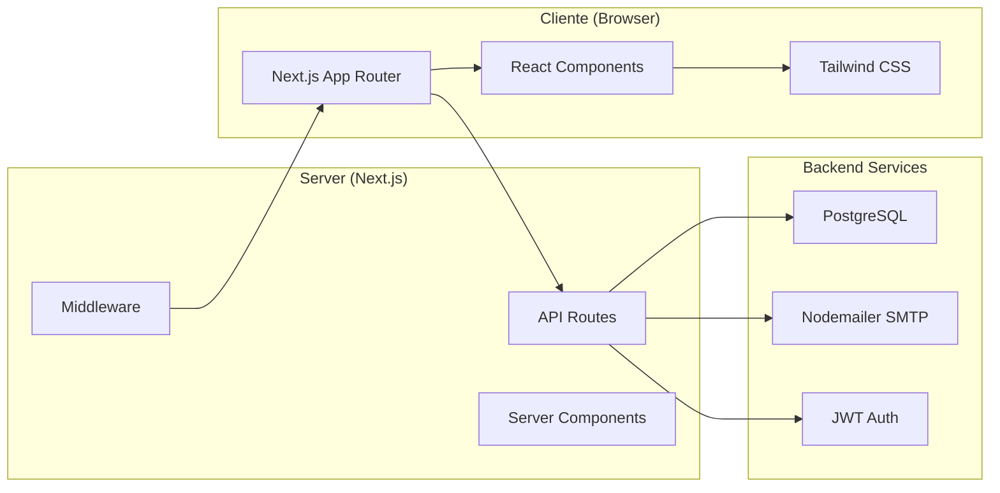
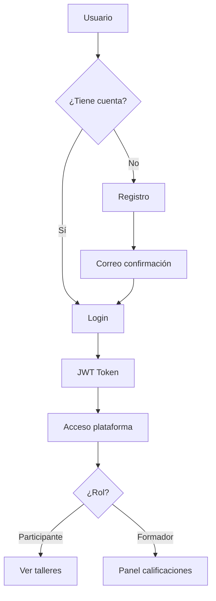

# 📊 Taller CPCI - Visualización Avanzada de Datos Catastrales

[](https://nextjs.org/)
[](https://reactjs.org/)
[](https://tailwindcss.com/)
[](https://www.postgresql.org/)
[](https://vercel.com/)

---

## 📋 Tabla de Contenidos

- [Descripción del Proyecto](#-descripción-del-proyecto)
- [Objetivos](#-objetivos)
- [Tecnologías Utilizadas](#-tecnologías-utilizadas)
- [Estructura del Proyecto](#-estructura-del-proyecto)
- [Arquitectura](#-arquitectura)
- [Funcionalidades Principales](#-funcionalidades-principales)
- [Roles y Permisos](#-roles-y-permisos)
- [Base de Datos](#-base-de-datos)
- [APIs y Endpoints](#-apis-y-endpoints)
- [Guía de Instalación](#-guía-de-instalación)
- [Variables de Entorno](#-variables-de-entorno)
- [Guía de Uso](#-guía-de-uso)
  - [Para Participantes](#para-participantes)
  - [Para Formadores](#para-formadores)
- [Flujo de Trabajo Git](#-flujo-de-trabajo-git)
- [Estado Actual](#-estado-actual)
- [Equipo de Desarrollo](#-equipo-de-desarrollo)
- [Licencia](#-licencia)

---

## 🎯 Descripción del Proyecto

**Taller CPCI** es una plataforma web moderna diseñada para la gestión integral de talleres de visualización avanzada de datos catastrales. Desarrollada para el **Comité Permanente sobre el Catastro en Iberoamérica (CPCI)**, esta aplicación permite:

- Gestión de inscripciones de participantes y formadores
- Administración de talleres y sus actividades
- Subida y gestión de ejercicios resueltos
- Sistema completo de calificaciones
- Gestión documental y de archivos
- Visualización de datos geográficos

El CPCI es un foro que agrupa a las instituciones públicas con funciones catastrales en Iberoamérica, constituido durante el IX Seminario sobre Catastro Inmobiliario celebrado en Cartagena de Indias, Colombia, en mayo de 2006.

---

## 🎯 Objetivos

### Generales
- Desarrollar una plataforma web moderna y escalable
- Facilitar la gestión de talleres y participantes
- Automatizar procesos de calificación y evaluación
- Integrar herramientas de visualización geográfica

### Específicos
- **Gestión de usuarios**: Registro, autenticación y roles
- **Gestión de talleres**: Visualización de actividades y materiales
- **Sistema de archivos**: Subida, almacenamiento y descarga de documentos
- **Sistema de calificaciones**: Evaluación y retroalimentación
- **Visualización geográfica**: Capas de datos y mapas interactivos

---

## 🛠️ Tecnologías Utilizadas

### Frontend
| Tecnología | Versión | Propósito |
|------------|---------|-----------|
| **Next.js** | 14.x | Framework React con App Router |
| **React** | 18.x | Biblioteca UI |
| **Tailwind CSS** | 3.x | Framework de estilos |
| **Lucide React** | Última | Iconos SVG |
| **React Phone Input 2** | Última | Entrada de teléfonos internacionales |
| **React Icons** | Última | Iconos adicionales |

### Backend
| Tecnología | Versión | Propósito |
|------------|---------|-----------|
| **Next.js API Routes** | 14.x | Endpoints serverless |
| **PostgreSQL** | 14.x | Base de datos relacional |
| **bcryptjs** | Última | Encriptación de contraseñas |
| **jsonwebtoken** | Última | Autenticación JWT |
| **Nodemailer** | Última | Envío de correos electrónicos |

### Herramientas de Desarrollo
| Tecnología | Propósito |
|------------|-----------|
| **Turbopack** | Bundler rápido para desarrollo |
| **ESLint** | Linting de código |
| **Git** | Control de versiones |
| **GitHub** | Repositorio remoto |

---

## 📁 Estructura del Proyecto

```text
tallercpci/
│
├── public/
│   ├── Img/                    # Imágenes y logos institucionales
│   │   ├── logocpci.png
│   │   ├── logo_2022.png
│   │   ├── jordi_guerrero.jpg
│   │   ├── ricardo_lopez.png
│   │   └── ... (otras imágenes)
│   ├── data/                   # Archivos de datos y documentos
│   │   ├── Ejercicio01_GeoMedellin.docx
│   │   ├── Propuesta técnica y económica - Taller 1.pdf
│   │   ├── Propuesta técnica y económica - Taller 2.pdf
│   │   └── Propuesta técnica y económica - Taller 3.pdf
│   └── uploads/                # Archivos subidos por usuarios
│       └── (archivos PDF subidos)
│
├── src/
│   ├── app/                    # App Router de Next.js
│   │   ├── api/                # API Routes
│   │   │   ├── auth/           # Autenticación
│   │   │   │   ├── login/
│   │   │   │   └── auto-login/
│   │   │   ├── calificaciones/ # Calificaciones
│   │   │   ├── inscripciones/  # Inscripciones
│   │   │   └── upload-taller/  # Subida de archivos
│   │   ├── auth/               # Páginas de autenticación
│   │   │   └── autologin-success/
│   │   ├── countries/          # Página de países
│   │   ├── mis-talleres/       # Panel de talleres/calificaciones
│   │   ├── perfil/             # Perfil de usuario
│   │   ├── taller/             # Página principal del taller
│   │   │   ├── tallerUno/      # Actividades Taller 1
│   │   │   ├── tallerDos/      # Actividades Taller 2
│   │   │   ├── tallerTres/     # Actividades Taller 3
│   │   │   ├── ejerciciosGeoMedellin/
│   │   │   ├── CapasDatos.jsx
│   │   │   └── page.jsx
│   │   ├── tratamiento-datos/  # Política de datos
│   │   ├── globals.css         # Estilos globales
│   │   ├── layout.js           # Layout principal
│   │   └── page.jsx            # Página de inicio
│   │
│   ├── components/             # Componentes reutilizables
│   │   ├── auth/               # Componentes de autenticación
│   │   │   └── ProtectedRoute.jsx
│   │   ├── home/               # Componentes de la página principal
│   │   │   ├── About.jsx
│   │   │   ├── Hero.jsx
│   │   │   └── Objectives.jsx
│   │   ├── layout/             # Layout estructural
│   │   │   ├── Footer.jsx
│   │   │   └── Header.jsx
│   │   ├── login/              # Modales de login
│   │   │   ├── ModalLogin.jsx
│   │   │   └── ModalRecuperarPassword.jsx
│   │   ├── taller/             # Componentes del taller
│   │   │   ├── MisArchivos.jsx
│   │   │   └── PanelCalificaciones.jsx
│   │   ├── tratamiento_datos_personales/
│   │   │   └── TratamientoDatos.jsx
│   │   └── ui/                 # UI Components
│   │       ├── ContadorInscritos.jsx
│   │       └── ModalInscripcion.jsx
│   │
│   ├── contexts/               # Context Providers
│   │   └── AuthContext.jsx     # Contexto de autenticación
│   │
│   ├── services/               # Servicios y queries
│   │   ├── auth/               # Servicios de autenticación
│   │   │   └── auth_queries.js
│   │   ├── calificaciones/     # Servicios de calificaciones
│   │   │   └── calificaciones_queries.js
│   │   ├── database/           # Conexión a base de datos
│   │   │   └── db.js
│   │   └── inscripciones/      # Servicios de inscripciones
│   │       └── inscripciones_queries.js
│   │
│   ├── templates/              # Plantillas de correos
│   │   ├── inscripcionEmail.js
│   │   └── resetPasswordEmail.js
│   │
│   ├── utils/                  # Utilidades
│   │   ├── email.js
│   │   └── jwt.js
│   │
│   └── middleware.js           # Middleware de autenticación
│
├── .env.local                  # Variables de entorno locales
├── .gitignore                  # Archivos ignorados por Git
├── eslint.config.mjs           # Configuración de ESLint
├── jsconfig.json               # Configuración de JS
├── next.config.js              # Configuración de Next.js
├── package.json                # Dependencias y scripts
├── package-lock.json           # Lock de dependencias
└── README.md                   # Documentación principal
```

---

## 🏗️ Arquitectura

La aplicación está desarrollada utilizando **Next.js 14** con **App Router**, siguiendo una arquitectura moderna y escalable:

### Arquitectura General



### Flujo de Autenticación



### Componentes de la Arquitectura

#### 1. **Presentación (Frontend)**
- **Next.js App Router**: Enrutamiento y renderizado
- **React Components**: UI interactiva
- **Tailwind CSS**: Estilos utilitarios
- **Context API**: Estado global (autenticación)

#### 2. **Lógica de Negocio (Backend)**
- **API Routes**: Endpoints RESTful
- **Controllers**: Lógica de negocio
- **Services**: Operaciones de base de datos
- **Middleware**: Autenticación y seguridad

#### 3. **Datos (Base de Datos)**
- **PostgreSQL**: Base de datos relacional
- **Queries**: Consultas parametrizadas
- **Migraciones**: Control de esquema

---

## ⚡ Funcionalidades Principales

### 1. Sistema de Autenticación
- Registro de usuarios (Participante/Formador)
- Inicio de sesión con JWT
- Recuperación de contraseña
- Auto-login por correo
- Protección de rutas con middleware

### 2. Gestión de Talleres
- **Tres talleres** con actividades específicas
- Descarga de propuestas en PDF
- Subida de ejercicios resueltos
- Visualización de archivos subidos

### 3. Sistema de Calificaciones
- **Participantes**: Suben ejercicios, ven calificaciones
- **Formadores**: Califican ejercicios (nota 0-10, aprobado, comentarios)
- **Panel de calificaciones**: Vista completa para formadores
- **Múltiples versiones**: Historial de archivos subidos

### 4. Perfil de Usuario
- Visualización de datos personales
- Información de cuenta (username, rol, estado)
- Datos profesionales (cargo, organización, país)

### 5. Visualización Geográfica
- Capas de datos en múltiples formatos (SHP, GeoJSON, CSV)
- Descarga de capas seleccionadas
- Integración con GeoMedellín

---

## 👥 Roles y Permisos

| Funcionalidad | Participante | Formador |
|---------------|--------------|----------|
| **Registro** | ✅ | ✅ |
| **Ver página del taller** | ✅ | ✅ |
| **Descargar propuestas** | ✅ | ✅ |
| **Subir ejercicios** | ✅ | ❌ |
| **Ver sus archivos** | ✅ | ❌ |
| **Ver calificaciones recibidas** | ✅ | ✅ (de todos) |
| **Calificar participantes** | ❌ | ✅ |
| **Ver todos los participantes** | ❌ | ✅ |
| **Mis Talleres** | ✅ (sus talleres) | ✅ (panel de calificaciones) |
| **Mi Perfil** | ✅ | ✅ |

---

## 🗄️ Base de Datos

### Tabla `inscripciones`

| Campo | Tipo | Descripción |
|-------|------|-------------|
| `id` | SERIAL | Primary Key |
| `username` | VARCHAR(50) | Nombre de usuario único |
| `password_hash` | VARCHAR(255) | Hash de la contraseña |
| `nombres` | VARCHAR(100) | Nombres del usuario |
| `apellidos` | VARCHAR(100) | Apellidos del usuario |
| `correo_electronico` | VARCHAR(100) | Correo electrónico |
| `telefono` | VARCHAR(20) | Número de teléfono |
| `cargo` | VARCHAR(100) | Cargo profesional |
| `pais` | VARCHAR(50) | País de residencia |
| `organizacion` | VARCHAR(150) | Organización/institución |
| `tiene_power_bi` | BOOLEAN | ¿Tiene Power BI? |
| `usa_otro_bi` | BOOLEAN | ¿Usa otro software BI? |
| `otro_bi` | VARCHAR(100) | Nombre del otro software BI |
| `tiene_arcgis_online` | BOOLEAN | ¿Tiene ArcGIS Online? |
| `rol` | VARCHAR(20) | `participante` o `formador` |
| `experiencia_bi` | BOOLEAN | Experiencia con herramientas BI |
| `nivel_geografico` | VARCHAR(20) | `basico`, `medio`, `avanzado` |
| `session_id` | UUID | ID de sesión |
| `reset_token` | VARCHAR(255) | Token de recuperación |
| `reset_token_expira` | TIMESTAMP | Expiración del token |
| `estado` | VARCHAR(20) | `ACTIVO`, `PENDIENTE`, `INACTIVO` |

### Tabla `calificaciones`

| Campo | Tipo | Descripción |
|-------|------|-------------|
| `id` | SERIAL | Primary Key |
| `inscripcion_id` | INTEGER | FK a `inscripciones.id` |
| `taller_id` | INTEGER | 1, 2, o 3 |
| `version` | INTEGER | Versión del archivo subido |
| `archivo_nombre` | VARCHAR(255) | Nombre del archivo |
| `archivo_ruta` | VARCHAR(500) | Ruta del archivo |
| `archivo_subido` | BOOLEAN | Si el archivo fue subido |
| `fecha_subida` | TIMESTAMP | Fecha de subida |
| `calificacion` | NUMERIC(3,1) | Nota (0-10) |
| `aprobado` | BOOLEAN | Aprobado/No aprobado |
| `comentarios` | TEXT | Comentarios del formador |
| `calificado` | BOOLEAN | Si fue calificado |
| `fecha_calificacion` | TIMESTAMP | Fecha de calificación |

---

## 🔌 APIs y Endpoints

### Autenticación
| Endpoint | Método | Descripción |
|----------|--------|-------------|
| `/api/auth/login` | POST | Inicio de sesión |
| `/api/auth/auto-login` | GET | Login automático con token |
| `/api/auth/recuperar-password` | POST | Solicitar recuperación |

### Inscripciones
| Endpoint | Método | Descripción |
|----------|--------|-------------|
| `/api/inscripciones` | POST | Crear inscripción |
| `/api/inscripciones/contador` | GET | Contar inscripciones |

### Calificaciones
| Endpoint | Método | Descripción |
|----------|--------|-------------|
| `/api/calificaciones` | GET | Obtener calificaciones |
| `/api/calificaciones` | POST | Guardar calificación |
| `/api/calificaciones` | DELETE | Eliminar calificación |

### Archivos
| Endpoint | Método | Descripción |
|----------|--------|-------------|
| `/api/upload-taller` | POST | Subir archivo de taller |

---

## 📦 Guía de Instalación

### Requisitos Previos
- **Node.js** 18.x o superior
- **PostgreSQL** 14.x o superior
- **npm** o **yarn**
- **Git**

### Pasos de Instalación

1. **Clonar el repositorio**
```bash
git clone https://github.com/MendozaJulioC/taller-cpci.git
cd taller-cpci
```

2. **Instalar dependencias**
```bash
npm install
```

3. **Configurar base de datos**
```bash
# Crear base de datos
createdb taller_cpci

# Ejecutar migraciones (si existen)
# O crear manualmente las tablas
```

4. **Configurar variables de entorno**
```bash
cp .env.local.example .env.local
# Editar .env.local con las credenciales reales
```

5. **Iniciar el servidor de desarrollo**
```bash
npm run dev
```

6. **Abrir en el navegador**
```
http://localhost:3001
```

---

## 🔐 Variables de Entorno

### Frontend (.env.local)
```env
# Base de datos
DB_HOST=localhost
DB_PORT=5432
DB_NAME=taller_cpci
DB_USER=postgres
DB_PASSWORD=tu_contraseña

# JWT
JWT_SECRET=tu_secreto_jwt
JWT_EXPIRES_IN=7d

# Email (SMTP)
SMTP_HOST=smtp.gmail.com
SMTP_PORT=587
SMTP_USER=correo@gmail.com
SMTP_PASSWORD=contraseña_app

# URLs
NEXTAUTH_URL=http://localhost:3001
NEXT_PUBLIC_APP_URL=http://localhost:3001
```

---

## 📖 Guía de Uso

### Para Participantes

#### 1. Registro
1. Haz clic en **"Inscripciones"** en el Header
2. Selecciona **"Inscribirse como Participante"**
3. Completa el formulario con tus datos:
   - Datos personales (nombres, apellidos, correo, teléfono)
   - Credenciales (usuario, contraseña)
   - Información profesional (cargo, país, organización)
   - Herramientas técnicas (Power BI, ArcGIS, etc.)
4. Acepta los términos y condiciones
5. Recibirás un correo de confirmación

#### 2. Acceso a la plataforma
1. Inicia sesión con tu usuario y contraseña
2. Accede a la página del taller desde el menú "Talleres"

#### 3. Descarga de material
1. Ve a la sección **"Capas de Datos"**
2. Selecciona las capas que necesitas
3. Descarga en el formato deseado (SHP, GeoJSON, CSV)
4. Descarga la propuesta de cada taller desde la sección correspondiente

#### 4. Subida de ejercicios
1. En cada taller, usa el botón **"Cargar Taller Resuelto"**
2. Selecciona tu archivo PDF
3. Espera la confirmación de subida
4. Si te equivocas, puedes eliminar el archivo y subir uno nuevo

#### 5. Revisión de calificaciones
1. Ve a **"Mis Talleres"** en el menú de usuario
2. Revisa tus talleres y calificaciones
3. Lee los comentarios del formador
4. Visualiza tu nota (0-10) y estado (aprobado/no aprobado)

### Para Formadores

#### 1. Registro
1. Haz clic en **"Inscripciones"** en el Header
2. Selecciona **"Inscribirse como Formador"**
3. Completa el formulario con tus datos

#### 2. Acceso al Panel de Calificaciones
1. Inicia sesión con tu usuario y contraseña
2. Ve a **"Mis Talleres"** en el menú de usuario
3. Verás el **Panel de Calificaciones** con todos los participantes

#### 3. Calificación de participantes
1. Busca al participante que deseas calificar (barra de búsqueda)
2. Expande su tarjeta para ver los talleres subidos
3. En cada taller, asigna:
   - **Nota**: valor numérico de 0 a 10
   - **Aprobado**: marcar/desmarcar
   - **Comentario**: texto adicional
4. Haz clic en **"Guardar calificación"**

#### 4. Visualización de resultados
1. Los participantes verán sus calificaciones en "Mis Talleres"
2. Puedes modificar las calificaciones en cualquier momento
3. El historial de calificaciones se guarda automáticamente

---

## 🌿 Flujo de Trabajo Git

### Ramas Principales
```text
main          # Rama de producción (estable)
develop       # Rama de desarrollo
```

### Ramas de Desarrollo
Cada colaborador trabaja en su propia rama:
```text
feature/julio      # Características específicas
feature/juan
feature/nombre-colaborador
```

### Flujo de Trabajo
```text
feature/* → develop → main
```

1. Crear rama desde `develop`
2. Realizar cambios y commits descriptivos
3. Push a la rama `feature`
4. Crear Pull Request hacia `develop`
5. Revisión y aprobación por otro colaborador
6. Merge a `develop`
7. Posteriormente merge de `develop` a `main`

### Convenciones de Commits
```bash
feat: crear página principal
fix: corregir validación de login
docs: actualizar README
refactor: reorganizar componentes
style: actualizar estilos CSS
test: agregar pruebas unitarias
chore: actualizar dependencias
```

---

## 📊 Estado Actual

### Versión 1.0 - Funcionalidades Implementadas

| Módulo | Estado | Descripción |
|--------|--------|-------------|
| **Autenticación** | ✅ Completado | Login, registro, recuperación |
| **Gestión de usuarios** | ✅ Completado | Roles y permisos |
| **Talleres** | ✅ Completado | Tres talleres con actividades |
| **Subida de archivos** | ✅ Completado | PDF con versionado |
| **Calificaciones** | ✅ Completado | Nota, aprobado, comentarios |
| **Panel de calificaciones** | ✅ Completado | Vista para formadores |
| **Perfil de usuario** | ✅ Completado | Visualización de datos |
| **Capas de datos** | ✅ Completado | SHP, GeoJSON, CSV |
| **Documentación** | ✅ Completado | README completo |

### Pendientes para futuras versiones
- [ ] Edición de perfil
- [ ] Notificaciones push
- [ ] Exportar calificaciones en CSV
- [ ] Integración con videoconferencia
- [ ] Certificados automáticos
- [ ] Sistema de badges y logros

---

## 👥 Equipo de Desarrollo

| Rol | Nombre |
|-----|--------|
| **Desarrollador Backend** | [Nombre del desarrollador] |
| **Desarrollador Frontend** | [Nombre del desarrollador] |
| **Diseñador UI/UX** | [Nombre del diseñador] |
| **Coordinador** | [Nombre del coordinador] |

**Comité Permanente sobre el Catastro en Iberoamérica (CPCI)**
- Sitio web: [https://taller-cpci.vercel.app](https://taller-cpci.vercel.app)

---

## 📄 Licencia

Este proyecto es propiedad del **Comité Permanente sobre el Catastro en Iberoamérica (CPCI)** y está protegido por derechos de autor.

---

## 🙏 Agradecimientos

Agradecemos a todas las instituciones y personas que han contribuido al desarrollo de esta plataforma, especialmente a:

- **CPCI** por su apoyo y visión
- **Alcaldía de Medellín** por la colaboración
- **Subsecretaría de Catastro** por los datos y recursos
- **Todos los participantes y formadores** que hacen posible este taller

---

**Desarrollado con ❤️ para el CPCI**

---

### 📝 Notas Adicionales

#### Seguridad
- Las contraseñas se almacenan hasheadas con bcrypt
- Autenticación basada en JWT
- Middleware que protege rutas privadas
- Validación de archivos subidos (solo PDF, máximo 20MB)

#### Rendimiento
- Uso de `useSyncExternalStore` para sincronización eficiente
- Carga diferida de componentes
- Optimización de imágenes con Next.js Image

#### Despliegue
La aplicación está preparada para desplegarse en **Vercel**, con soporte para:
- Variables de entorno
- Base de datos PostgreSQL (supabase)
- Dominios personalizados
- SSL automático

---

## 🔗 Enlaces Útiles

- [Next.js Documentation](https://nextjs.org/docs)
- [Tailwind CSS Documentation](https://tailwindcss.com/docs)
- [PostgreSQL Documentation](https://www.postgresql.org/docs)
- [React Documentation](https://react.dev)
- [CPCI Official Website](https://taller-cpci.vercel.app)

---

*Última actualización: Agosto 2026*